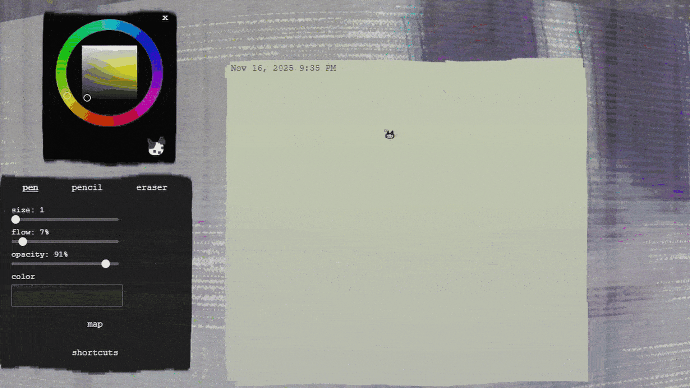
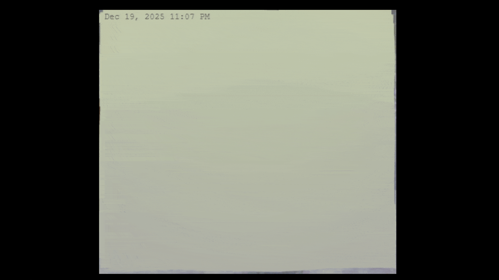
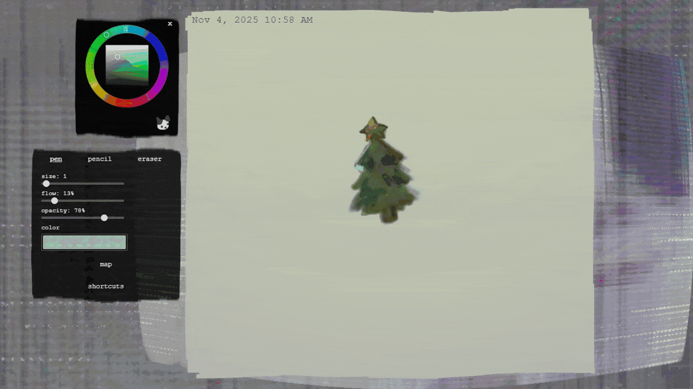

# 🫧 Guestbook 🍊

Browser-based collaborative guestbook where people can leave notes, write, and draw together simultaneously in real-time on shared 2D/3D canvases!

# ☃️ Description

### 💌 Features

- **Collaborative drawing:** Multiple users can draw on the same canvas with real-time updates.
- **Presence cursors:** Anonymous cursors for other users and activity feedback
- **Painting tools:** 
    - Pen | Pencil | Eraser with pressure curve and adjustable settings (size, opacity, flow)
    - Colorwheel and eyedropper
- **2D notes:** Freehand drawing canvas with undo/redo history | Text content | Import images
- **3D canvases:** Cube, sphere, or 2.5D modes. Draw on any 2D plane within 3D scene

### 🎐 Technologies

- **JavaScript**: drawing functionality/interactivity
- **WebGL**/**Three.js**: 3D canvases
- **HTML/CSS**: appearance and layout
- **Firebase Realtime Database**: sync and note changes/snapshots

# 🫐Usage

### 🍀 Keyboard & Mouse Shortcuts

- **[MB2]:** Open the dropdown context menu for quick actions
- **[b]:** Switch to Pen
- **[p]:** Switch to Pencil
- **[e]:** Switch to Eraser
- **[Ctrl/Cmd + z]** Undo
- **[Ctrl/Cmd + y]:** Redo
- **[n]:** New text note
- **[d]:** New paint note
- **[h]:** Flip paint note horizontally
- **[Shift + MB1]:** Rotate 3D scene
- Drag note corners to move

### 🎄 Local development

- Requires setting up Firebase (creating a Firebase project and enabling Realtime Database).
- Update `notes/js/firebase.js` with your project keys and database URL

# 🍈 Future Improvements

- **Avatars showing active users:** Add visual indicators (desktop pets) to display which users are currently active and what they're working on.
- **Personalization**: Customizing brushes, UI, or how the cursors appear
- **Real-time sync:** When multiple users draw on the same note simultaneously, strokes can occasionally be overwritten due to the snapshot sync. Move from canvas snapshots to individual stroke events
- **Drawing layers:** Implement layer arrangement options to keep canvas elements separate to be edited independently.
- **Export/import:** Save and restore whiteboard canvas or individual notes
